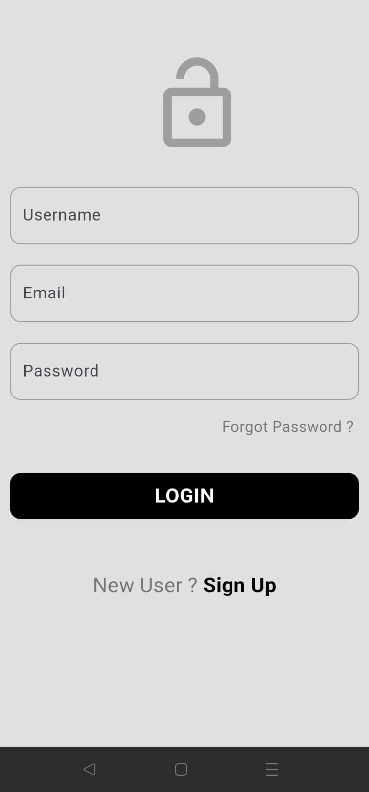
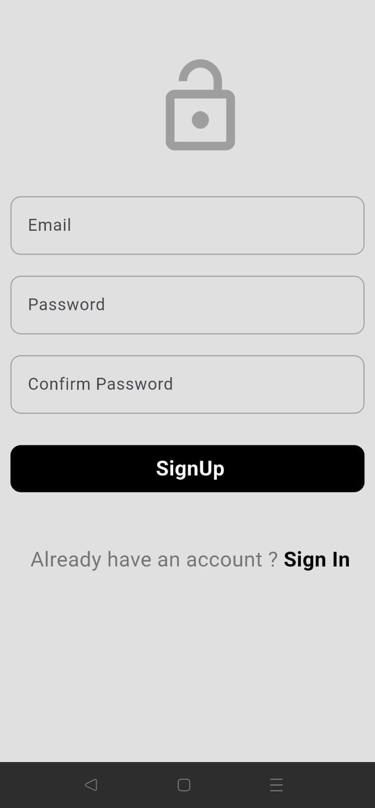
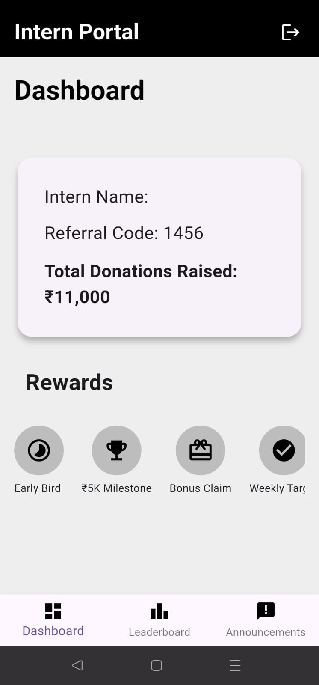
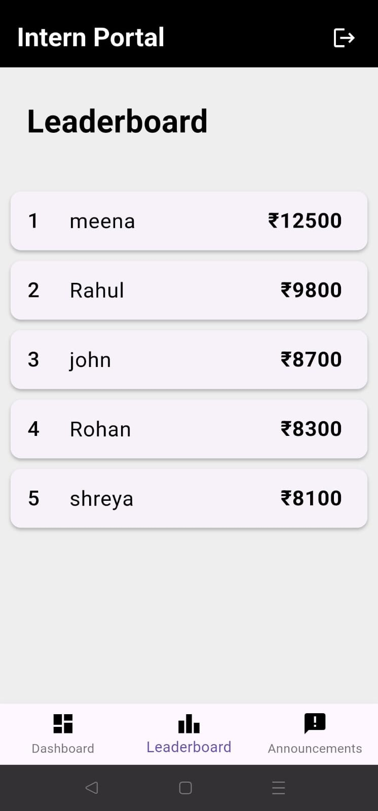
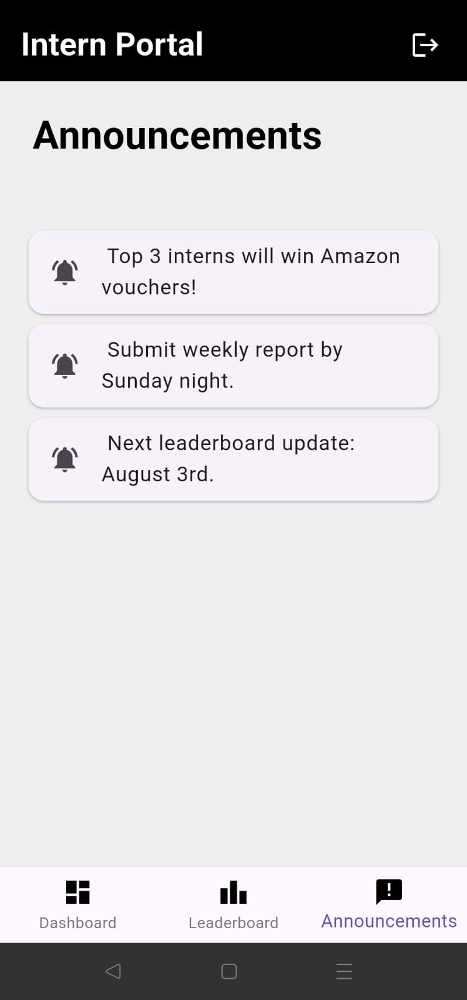

# 🧑‍💻 Intern Dashboard App

A simple mobile app built with **Flutter** to simulate a **fundraising intern portal**. This app showcases key intern-related functionalities like referral tracking, donation leaderboard, and announcements.

---

## ✨ Features

- 🔐 Login & Signup pages
- 📊 Intern dashboard showing:
    - Intern name
    - Referral code
    - Total donations raised
    - Unlockables (rewards or perks)
- 🏆 Leaderboard with top donors
- 📢 Announcements section
- 🎨 Clean, minimal UI with animations

---

## 🖼️ Screenshots







```plaintext
ScreenShots/
├── login.jpeg
├── signup.jpeg
├── Dashboard.jpeg
├── leaderboard.jpeg
└── Announcements.jpeg
